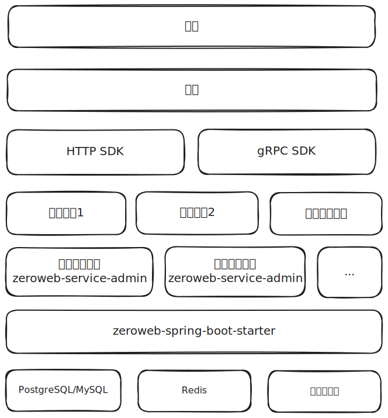
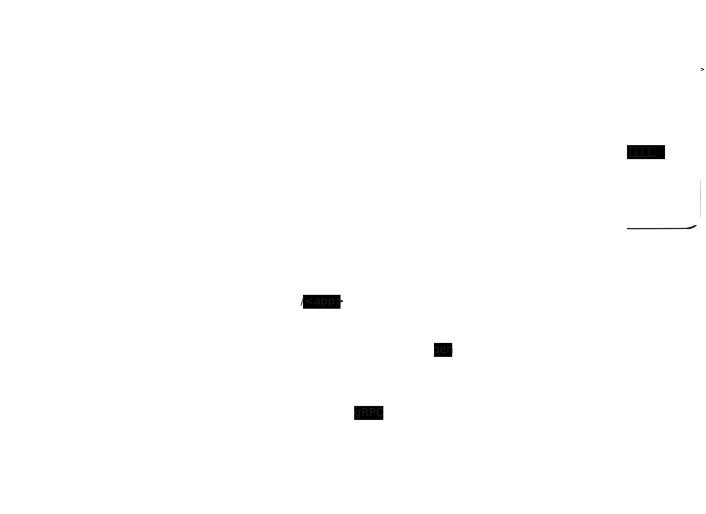

# ZeroWeb

ZeroWeb 是一组 BaaS(Backend as a Service)，可以低成本地实现认证授权、后台管理、开放平台等功能。提供 gRPC 接口 SDK（后端集成）与 HTTP 接口 SDK（前端集成）。

## 功能特性

- [后台管理服务](zeroweb-service/zeroweb-service-admin/README.md)
  - 认证
  - 单点登录
  - 字典管理
- [服务间接口SDK](zeroweb-proto/README.md)
  - 第三方应用管理
  - 对外接口的管理、订阅、调用

## 使用方式

### 独立部署

本项目优先支持此方式。

本项目的每一个服务都会以镜像的形式发布到 ghcr。开发与部署时选择所需要的服务部署，然后通过集成业务系统语言对应的SDK，调用ZeroWeb服务进行交互。其中 zeroweb-service-admin 服务是必须部署的，因为其被其他所有服务所依赖。除非特殊说明，其他服务之间不会有强依赖关系。

### 二次开发

即在本项目的源代码基础上进行修改。该方式违背了这个项目的初衷，所以不会获得任何支持，不推荐使用该方式。

本项目遵循 LGPL 3.0 开源协议，对源代码的修改需要遵循相同的协议进行开源。

## 应用架构

## [开发者手册](./CONTRIBUTING.md)

## [技术栈](https://xezzon.github.io/zeroweb-spring/dependencies.html)

## [License](https://xezzon.github.io/zeroweb-spring/licenses.html)

