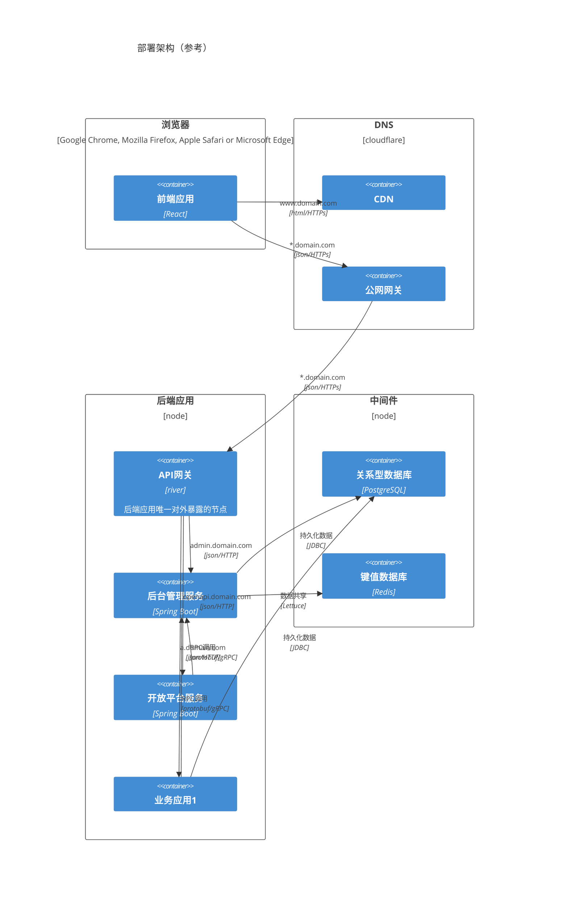

# Geom

基于 Spring Boot 框架的一组微服务构件，包含认证、后台管理、开放平台等服务。提供 SDK 与服务进行交互。

不同于市面上主流的后台管理系统，本项目的定位不是脚手架。本项目希望使用者通过独立部署服务的方式，作为一个系统的一部分提供功能。对于使用者而言，本项目的内部实现应视为黑箱。使用者无需（也不应该）对本项目的源代码进行二次开发，而是通过SDK提供的API与服务进行交互。

## 功能特性

- [后台管理服务](./geom-service/geom-service-admin/README.md)
  - 认证
  - 单点登录
- [服务间接口SDK](./geom-proto/README.md)

## 使用方式

### 独立部署

本项目优先支持此方式。

本项目的每一个服务都会以镜像的形式发布到 ghcr。开发与部署时选择所需要的服务部署，然后通过集成业务系统语言对应的SDK，调用geom服务进行交互。其中 geom-service-admin 服务是必须部署的，因为其被其他所有服务所依赖。除非特殊说明，其他服务之间不会有强依赖关系。

### 二次开发

即在本项目的源代码基础上进行修改。该方式违背了这个项目的初衷，所以不会获得任何支持，不推荐使用该方式。

本项目遵循 LGPL 3.0 开源协议，对源代码的修改需要遵循相同的协议进行开源。

## 应用架构

## [开发者手册](./CONTRIBUTING.md)

## [技术栈](https://xezzon.github.io/geom-spring-boot/dependencies.html)

## [License](https://xezzon.github.io/geom-spring-boot/licenses.html)

