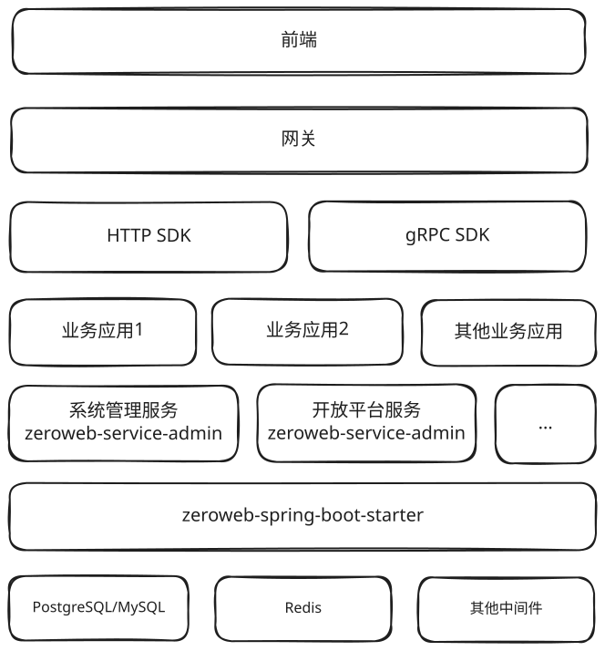
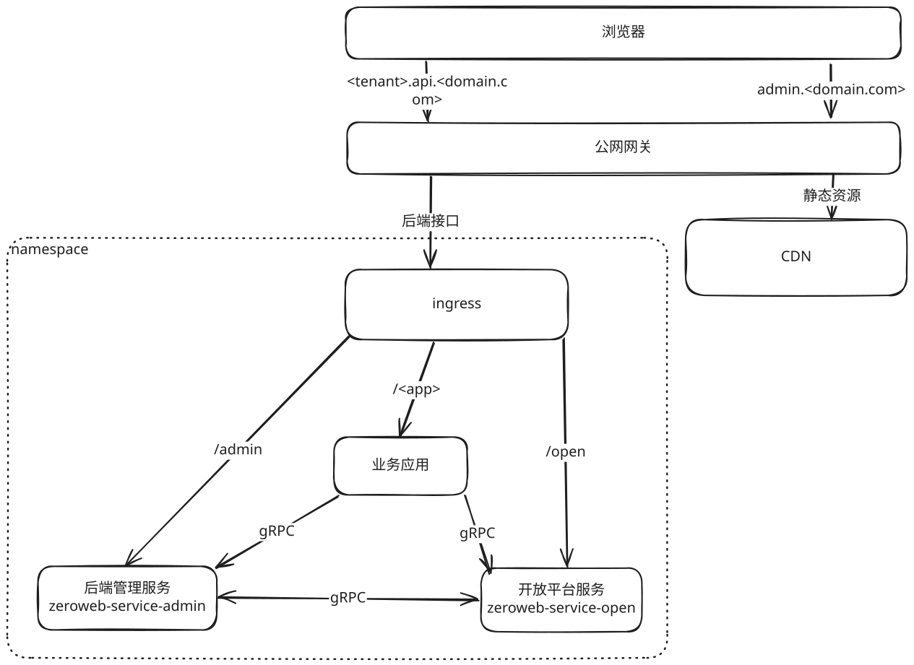

# ZeroWeb

[](https://sonarcloud.io/summary/new_code?id=xezzon_zeroweb-spring)
[](https://sonarcloud.io/summary/new_code?id=xezzon_zeroweb-spring)
[](https://sonarcloud.io/summary/new_code?id=xezzon_zeroweb-spring)


ZeroWeb 是一组 BaaS (Backend as a Service)，可以低成本地实现认证授权、系统管理、开放平台等功能。提供 gRPC 接口 SDK（后端集成）与 HTTP 接口 SDK（前端集成）。

## 功能特性

- 微服务
  - [系统管理服务](zeroweb-service/zeroweb-service-admin/README.md)
    - 认证
    - 单点登录
    - RBAC 模型授权
    - 用户管理
    - 字典管理
    - 业务参数管理
  - [开放平台服务](zeroweb-service/zeroweb-service-open/README.md)
      - 第三方应用管理
      - 第三方应用调用本系统 HTTP 接口
  - [附件管理服务](zeroweb-service/zeroweb-service-file/README.md)
    - 集中管理所有业务的附件
    - 支持将附件文件存储到硬盘和 S3 兼容的存储系统
  - [研发平台服务](zeroweb-service/zeroweb-service-dev/README.md)
    - 国际化管理
- SDK
  - [服务间接口 SDK](zeroweb-proto/README.md)
  - [前后端接口 SDK](https://www.npmjs.com/package/@xezzon/zeroweb-sdk)

## 快速启动

复制并调整 [docker-compose.yml](docs/docker/zeroweb/docker-compose.yml) 后，使用以下命令启动：

```shell
docker compose up -d
```

## 特点

### 微服务

ZeroWeb 的每一个微服务能够被独立地测试、构建、部署。微服务之间相互不耦合，也不会将所有微服务打包到一起。

虽然 ZeroWeb 目前的几个微服务使用的都是 Java 语言，然而使用者可以用 Rust、NodeJS，或者任何异构的语言与框架与 ZeroWeb 服务进行集成。

### 模块化

每一个微服务都被视为一组 HTTP 接口、一组 gRPC 接口的集合。对于使用者而言，只需根据这些接口与之交互，而接口内部是黑盒。

也因此，ZeroWeb 的单元测试针对的是这些 HTTP/gRPC 接口。且接口内部禁止使用 Mock，而是代之以 Testcontainers 保证与数据库等外部服务的对接也是正确的。

### 容器优先

ZeroWeb 将容器视为基础设施，所以设计是容器友好的。比如配置依靠环境变量实现、服务发现依赖 Docker Network。微服务发布的构件也是以镜像优先，目前并不提供 jar 包。

虽然是容器优先，但是并不意味着不兼容其他方式。ZeroWeb 对基础设施没有显式的依赖。shell 也可以实现环境变量，服务发现也能通过私有 DNS 实现。也就是说，ZeroWeb 是可以通过运维手段，而不需要改代码，就可以实现相当丰富的设计。

### 约定优先

ZeroWeb 以及与 ZeroWeb 集成的服务需要遵循一些约定。这会让一些事情变得简单。下面用一些例子进行说明。

**约定一**: 使用 JWT 作为认证头格式。这是微服务可以异构的前提。

**约定二**: 所有服务（包括前端、后端）通过 `GET /metadata/menu.json` 返回同构的 JSON 数组，实现菜单自省。通过这种方式，免去了在不同部署（测试环境、生产环境）之间同步菜单的麻烦。

## 应用架构





## 与同类产品的比较

本产品在功能上对标 [RuoYi-Vue-Pro —— 一个被广泛使用的管理系统脚手架](https://gitee.com/zhijiantianya/ruoyi-vue-pro)。

### 功能特性

|           | ZeroWeb  | RuoYi |
|-----------|----------|-------|
| 认证授权      | √        | √     |
| 用户管理      | 未来支持     | √     |
| 部门管理      | 暂无计划     | √     |
| 岗位管理      | 暂无计划     | √     |
| 租户管理      | 通过运维手段解决 | √     |
| 字典管理      | √        | √     |
| 参数管理      | √        | √     |
| 消息通知      | 未来支持     | √     |
| 附件管理      | √        | ×     |
| 第三方应用集成平台 | √        | ×     |
| WebHook   | 未来支持     | ×     |
| 国际化管理     | √        | √     |
| 定时任务      | ×        | √     |
| 代码生成      | ×        | ×     |
| 流程平台      | 未来支持     | √     |
| 操作日志      | 通过运维手段解决 | √     |
| 系统监控      | 通过运维手段解决 | √     |

### 运维方式

|             | ZeroWeb                                          | RuoYi                                                              |
|-------------|--------------------------------------------------|--------------------------------------------------------------------|
| 首选集成方式      | 通过 Docker 镜像部署容器。可以与任意技术栈进行集成。                   | 拉代码进行二次开发。技术栈基本取决于 RuoYi。                                          |
| 交互方式        | 前端通过 HTTP 或者封装的 JS SDK 进行交互。后端通过 gRPC 进行交互。      | 前端通过 HTTP 进行交互。未封装 SDK，需要拉对应的前端代码。                                 |
| 应用配置        | 推荐修改的配置通过环境变量暴露出来（可以很好地兼容 Docker 与 K8s，也兼容配置中心）。 | 所有配置都需要改配置文件（虽然也可以通过环境变量，但是支持并不良好）。不容易做到不改配置的情况下分发多套软件（即一套代码到处运行）。 |
| DDL管理       | 使用 Liquibase 自动化迁移。应用启动时即执行 DDL。                 | 提供 DDL 语句，需要使用者手动执行。                                               |
| 遥测（链路追踪、日志） | 遵循 OpenTelemetry 协议                              | 接入 SkyWalking                                                      |

### 开发方式


|      | ZeroWeb                                                                                                                                                                        | RuoYi                         |
|------|--------------------------------------------------------------------------------------------------------------------------------------------------------------------------------|-------------------------------|
| 模块划分 | 将不同的领域分为不同的模块。每个模块构建为独立的 Docker 镜像。领域之间的交互极少。                                                                                                                                  | 将不同的领域划分为不同的模块。在上帝模块中引入需要的模块。 |
| 包划分  | 按功能分包。功能与功能之间通过有限知识的接口进行交互（高内聚低耦合）。可以很轻松地将一个功能迁移到其他模块。                                                                                                                         | 同一模块内按 MVC 层次分包。              |
| 单元测试 | [](https://sonarcloud.io/summary/new_code?id=xezzon_zeroweb-spring) | N/A                           |


## [开发者手册](./CONTRIBUTING.md)

## [技术栈](https://xezzon.github.io/zeroweb-spring/dependencies.html)

## 商业化

现在以及将来，都不会对代码本身以及文档进行收费。

可能的收入途径：

- 捐赠
- 付费咨询
- 培训
- SaaS 化部署
- 衍生的周边项目
- 定制化二次开发

## [License](https://xezzon.github.io/zeroweb-spring/licenses.html)

ZeroWeb 采用 [LGPL 3.0](COPYING.LESSER) 许可证。该许可证保证 ZeroWeb 及衍生品是自由软件，代码、文档将保持开放；同时保证以构件形式集成 ZeroWeb 的项目不会被传染。

如需二次开发，请注意：

- 禁止修改、删除 copyright 申明。
- 需要保留 LGPL 3.0 许可证并开源。
