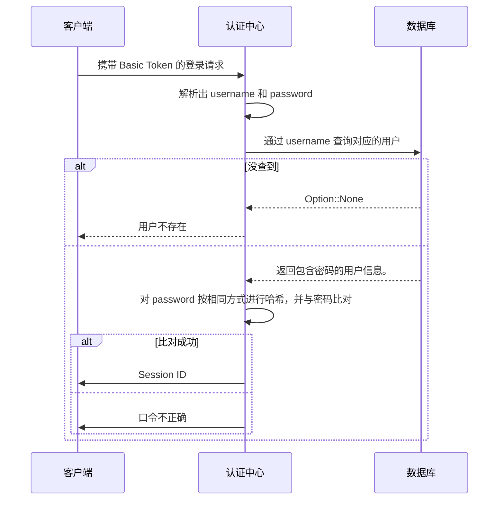
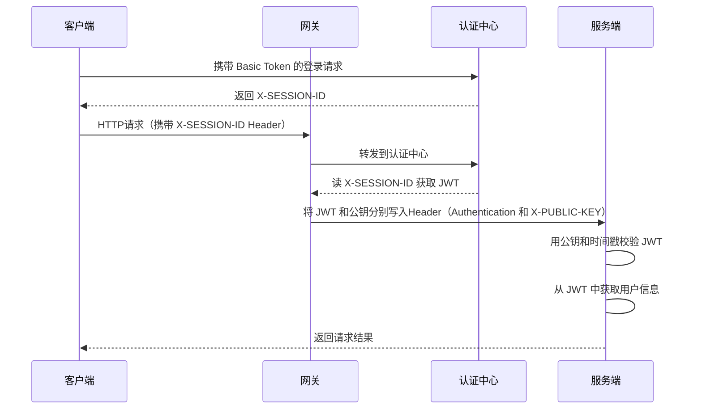
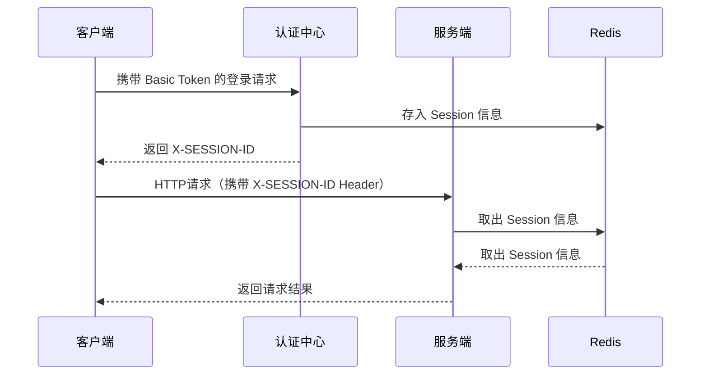

# 认证

## 引用文档

[用户模块](../user/README.md)

## 术语定义

- `认证`: 用户向系统证明自己身份的过程。该过程需要出示只有该用户自己才能够出示的凭证，最常用的凭证是`口令`。
- `令牌`: 认证通过后，系统应当向用户颁发令牌。令牌具有与 用户名+口令 同等的效力，但不包含密码之类的隐私信息。

## 功能描述

```mermaid
C4Dynamic
  title ''
```

## 数据字典

## 接口清单

### 用户登录（用户名、口令模式）

#### HTTP接口

POST /auth/login/basic

#### 业务逻辑



### 单点登录

#### HTTP接口

POST /auth/sso

#### 网关模式（推荐）



#### Redis 共享模式



#### 签发 [JWT](https://jwt.io/)

本系统签发的 JWT 采用 ES256 算法。

claim 命名参照 [IANA 机构](https://www.iana.org/assignments/jwt/jwt.xhtml) 内已注册的 claim，包含以下内容：

| 字段                 | 含义      | 注释                       |
|--------------------|---------|--------------------------|
| iss                | 机构名称    |                          |
| sub                | 认证者ID   |                          |
| iat                | 令牌签发时间戳 |                          |
| exp                | 令牌过期时间戳 | 如果当前时间戳大于exp，则令牌视为无效。选填。 |
| nbf                | 令牌生效时间  | 如果当前时间戳小于nbf，则令牌视为无效。选填。 |
| jti                | 令牌ID    | 生成的UUID。选填。              |
| preferred_username | 用户名     |                          |
| nickname           | 用户昵称    |                          |
| roles              | 持有者角色   | 类型为 String[]。            |
| groups             | 所在用户组   | 类型为 String[]。            |
| entitlements       | 持有者权限   | 类型为 String[]。            |

#### 操作权限
