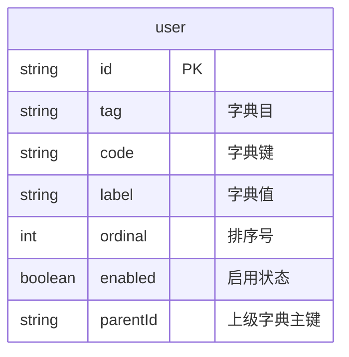
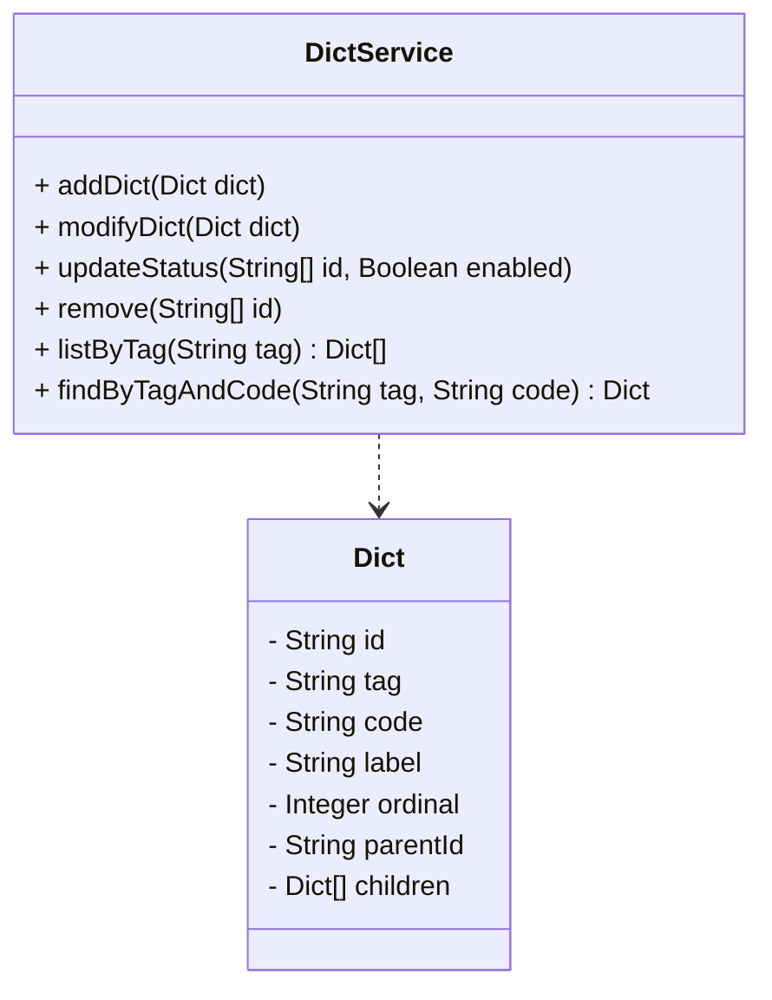

# 字典管理

```mermaid
erDiagram
  user {
    string id PK
    string tag "字典目"
    string code "字典键"
    string label "字典值"
    int ordinal "排序号"
    boolean enabled "启用状态"
    string parentId "上级字典主键"
  }
```

```mermaid
classDiagram
  class Dict {
    - String id
    - String tag
    - String code
    - String label
    - Integer ordinal
    - String parentId
    - Dict[] children
  }
  class DictService {
    + addDict(Dict dict)
    + modifyDict(Dict dict)
    + updateStatus(String[] id, Boolean enabled)
    + remove(String[] id)
    + listByTag(String tag) Dict[]
    + findByTagAndCode(String tag, String code) Dict
  }
  DictService ..> Dict
```

## 字典目管理

字典目可视为特殊的字典项，其字典目为`DICT`，上级ID为`0`。
