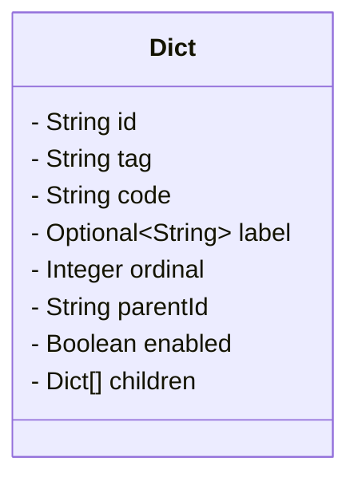

# 字典管理

## 引用文档

## 术语定义

- `字典`: 字典是一组提供给用户选择的值。如`性别`、`行政区`等。
- `字典目`: 一组相关的、被穷举的概念的集合，`字典目`下的每一项被称为`字典项`。如由字典项`男性`、`女性`组成的字典目`性别`。`字典目`可视为特殊的`字典项`，将所有的`字典目`视为`字典项`组成一个`总字典`。
- `字典键`: 系统存储字典时，存储的内容为`字典键`，如系统中存储`性别`时，将`男性`存储为`MALE`，`女性`存储为`FEMALE`，其中`MALE`、`FEMALE`即为`字典键`。同一`字典目`下不能有相同的`字典键`。
- `字典值`: `字典键`对应的值，如`MALE`对应`男性`，`FEMALE`对应`女性`，其中`男性`、`女性`即为`字典值`。

## 功能描述

```mermaid
C4Dynamic
  title ''
```

## 数据字典



### 字典 Dict

| 字段编码     | 字段名称   | 字段说明                                 | 字段约束             |
|----------|--------|--------------------------------------|------------------|
| id       | 字典标识   |                                      | 唯一               |
| tag      | 字典目    | 字典目可以视为特殊的字典项，该值为`DICT`              | 字典目 + 字典码 唯一     |
| code     | 字典键    |                                      | 仅允许大写字母、小写字母、下划线 |
| label    | 字典值    |                                      |                  |
| ordinal  | 字典顺序   | 数值越小，顺序越靠前                           |                  |
| parentId | 上级字典标识 | 用于将字典组织成树形结构<br/>字典目可视为特殊的字典项，该值为`0` |                  |
| children | 下级字典数组 |                                      |                  |
| enabled  | 启用状态   |                                      |                  |

## 接口清单

### 新增字典

#### HTTP接口

POST /dict/add

#### 输入输出1

输入：

- 字典目
- 字典键
- 字典值
- 字典顺序
- 上级字典标识

默认值：

- 启用状态。默认为`true`启用。

输出：

- 字典标识

#### 输入输出2

输入：

- 字典目。值为`DICT`
- 字典键
- 字典值
- 字典顺序
- 上级字典标识。值为`0`

默认值：

- 启用状态。默认为`true`启用。

输出：

- 字典标识

#### 异常输入输出1

输入：

- 字典目、字典键（字典目+字典键与已有字典重复）
- 字典值
- 字典顺序
- 上级字典标识

输出：

字典已存在。

#### 操作权限

### 编辑字典

#### HTTP接口

PUT /dict/update

#### 输入输出1

输入：

- 字典标识
- 字典键
- 字典值
- 字典顺序
- 上级字典标识

#### 异常输入输出1

输入：

- 字典标识
- 字典键（与同一字典目下其他字典的键冲突）
- 字典值
- 字典顺序
- 上级字典标识

输出：

字典已存在。

### 批量删除字典

#### HTTP接口

DELETE /dict

#### 输入输出1

输入：

- 字典标识集合

#### 输入输出2

输入：

- 字典标识集合（其中部分标识找不到对应数据）

#### 输入输出3

输入：

- 字典标识集合（所有标识都找不到对应的数据）

### 查询字典目列表（分页）

#### HTTP接口

GET /dict

#### 输入输出1

输入（遵循OData标准）：

- `$top`: 数据量
- `$skip`: 数据量*(页码-1)

### 批量启用/禁用字典

#### HTTP接口

PUT /dict/update/status

#### 输入输出1

输入：

- 字典标识集合
- 更新后的启用状态

#### 输入输出2

输入：

- 字典标识集合（其中部分或全部标识找不到对应数据）
- 更新后的启用状态

#### 输入输出3

输入：

- 字典标识集合（其中部分或全部标识对应的数据与更新后的启用状态相同）
- 更新后的启用状态

### 查询指定字典目下所有字典项的列表

#### HTTP接口

GET /dict/tag/{tag}

#### RPC接口

#### 输入输出1

输入：

- 字典目

HTTP接口输出：

- 字典项列表（树形结构）

RPC接口输出：

- 字典项列表
