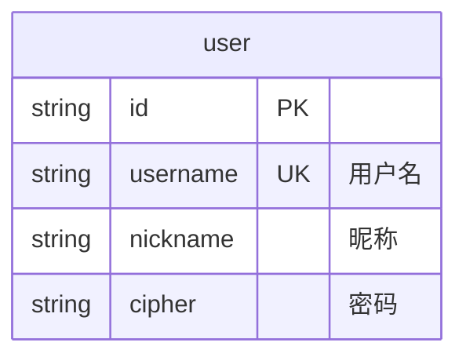
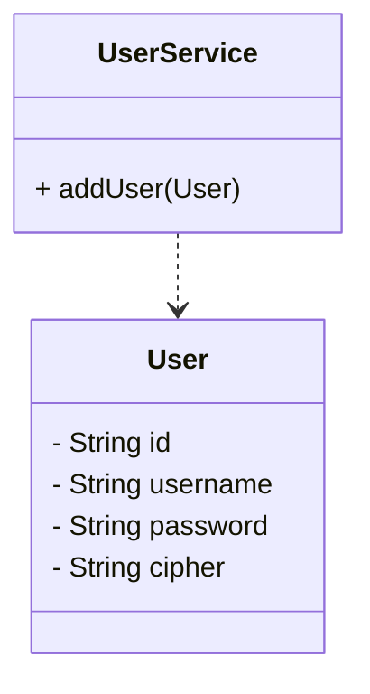

# 用户管理

## 用户注册

### 口令“加密”

保存到数据库前，需要将用户的`口令`(password)进行单向的哈希计算得到`密码`(cipher)。

哈希算法采用`BCrypt`。BCrypt 算法会将原文进行加盐，而后进行多轮哈希计算，最后将哈希结果、哈希次数、盐进行组合后得到密文。

BCrypt 具有以下特性：

- 对任意口令a，找不到另一个口令b（$b\neq a$），使得 $bcrypt(a, salt_a, times_a) = bcrypt(b, salt_m, times_n)$。即无法被哈希碰撞。
- 若$a = b$，则 $bcrypt(a, salt_a, times_a) = bcrypt(b, salt_a, times_a)$。即结果是稳定的。
- 对 $bcrypt(a, salt_a, times_a) = c$，找不到函数 dBcrypt，使得 $dBcrypt(c, salt_m, times_n) = a$。即结果是单向的。
