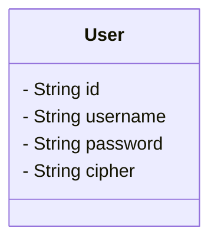

# 用户管理

## 引用文档

## 术语定义

- `用户`: 资源的使用者，系统只会向用户属于其自己的资源。包含用户名、昵称、密码等属性。
- `用户名`: 用户的唯一标识。由大写字母、小写字母、数字、下划线`_`、短横线`-`中的一种或多种组成。
- `昵称`: 用户的称呼，可以是名字或者用户自己设置的名称。
- `口令`: 为了防止身份被冒用，由用户设置的、只有用户自己知晓的口令。为了避免被很容易地猜到，口令的长度应该在8之上，且至少包含大写字母、小写字母、数字、符号（@!#$%^&*）之中的至少3种。口令对用户应该称呼为”密码“。
- `密码`: 口令被加密后的内容。

## 功能描述

```mermaid
C4Dynamic
  title ''
```

## 数据字典



### 用户 User

| 字段编码     | 字段名称 | 字段说明 | 字段约束                            |
|----------|------|------|---------------------------------|
| id       | 用户标识 |      | 唯一                              |
| username | 用户名  |      | 唯一                              |
| nickname | 昵称   |      |                                 |
| password | 口令   |      | 至少8位，不允许是纯大写、纯小写或纯数字<br/>不允许被存储 |
| cipher   | 密码   |      | 不允许被序列化                         |


## 接口清单

### 用户注册

#### HTTP接口

POST /user/register

#### 输入输出1

输入：

- 用户名
- 昵称
- 口令

输出：

- 用户ID

#### 异常输入输出1

输入：

- 用户名（用户名已存在）
- 昵称
- 口令

错误提示：

用户已存在。

#### 异常输入输出2

输入：

- 用户名（用户名不符合规则）
- 昵称
- 口令

错误提示：

用户名必须是3~32位 小写字母/数字/下划线 组成的字符串。

#### 异常输入输出3

输入：

- 用户名
- 昵称
- 口令（口令不符合规则）

错误提示：

密码由至少8位有效字符构成，且不允许是纯数字、纯小写或者纯大写字母

#### 口令“加密”

保存到数据库前，需要将用户的`口令`(password)进行单向的哈希计算得到`密码`(cipher)。

哈希算法采用`BCrypt`。BCrypt 算法会将原文进行加盐，而后进行多轮哈希计算，最后将哈希结果、哈希次数、盐进行组合后得到密文。

BCrypt 具有以下特性：

- 对任意口令a，找不到另一个口令b（$b\neq a$），使得 $bcrypt(a, salt_a, times_a) = bcrypt(b, salt_m, times_n)$。即无法被哈希碰撞。
- 若$a = b$，则 $bcrypt(a, salt_a, times_a) = bcrypt(b, salt_a, times_a)$。即结果是稳定的。
- 对 $bcrypt(a, salt_a, times_a) = c$，找不到函数 dBcrypt，使得 $dBcrypt(c, salt_m, times_n) = a$。即结果是单向的。

#### 操作权限
