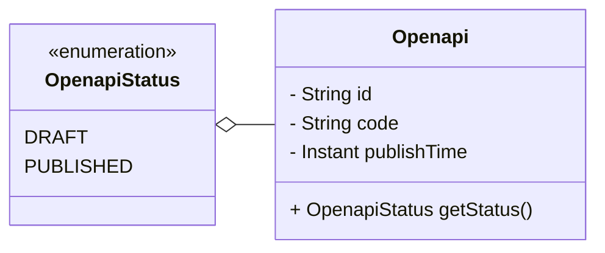

# 对外接口管理

## 引用文档

## 术语定义

## 功能描述

## 数据字典

### 对外接口 Openapi

| 字段编码   | 字段名称 | 字段说明 | 字段约束                                    |
|--------|------|------|-----------------------------------------|
| id     | 接口标识 |      | 唯一                                      |
| code   | 接口编码 |      | 字母、数字、下划线。 唯一。                      |
| status | 接口状态 |      | 枚举值： DRAFT: 草稿; PUBLISHED: 已发布; |

## 接口清单

### 新增对外接口

#### HTTP接口

POST /openapi/add

#### 输入输出1

输入：

- 接口编码

默认值：

- 接口状态。默认为草稿。

输出：

- 接口标识

#### 异常输入输出

- 接口已存在。

### 查询对外接口

#### HTTP接口

GET /openapi

#### 输入输出1

输入（遵循OData标准）：

- `$top`: 数据量
- `$skip`: 数据量*(页码-1)

输出：

- 分页信息
- 接口列表

### 编辑对外接口

#### HTTP接口

PUT /openapi/update

#### 输入输出1

输入：

- 接口标识
- 接口编码

#### 异常输出

- 接口已存在。
- 数据不存在或已删除。
- 接口已发布，无法编辑。

### 发布对外接口

#### HTTP接口

PUT /openapi/publish/{id}

#### 输入输出1

输入：

- 接口标识

#### 异常输出

- 数据不存在或已删除。
