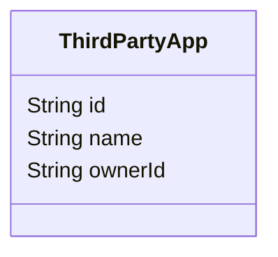

# 第三方应用管理

## 引用文档

## 术语定义

## 功能描述

## 数据字典

### 第三方应用 ThirdPartyApp

| 字段编码    | 字段名称 | 字段说明       | 字段约束 |
|---------|------|------------|------|
| id      | 应用标识 |            | 唯一   |
| name    | 应用名称 |            |      |
| ownerId | 所属人  | 创建应用者的用户标识 |      |

## 接口清单

### 新增应用

#### HTTP接口

POST /third-part-app/add

#### 输入输出1

输入：

- 应用名称

输出：

- 应用ID

### 查询我的应用列表

#### HTTP接口

GET /third-part-app/mine

#### 输入输出1

输入：

- `$top`: 数据量
- `$skip`: 数据量*(页码-1)

后端输入：

- 当前用户ID

输出：

- 应用列表

### 查询所有应用列表

#### HTTP接口

GET /third-part-app

#### 输入输出1

输入：

- `$top`: 数据量
- `$skip`: 数据量*(页码-1)

输出：

- 应用列表
