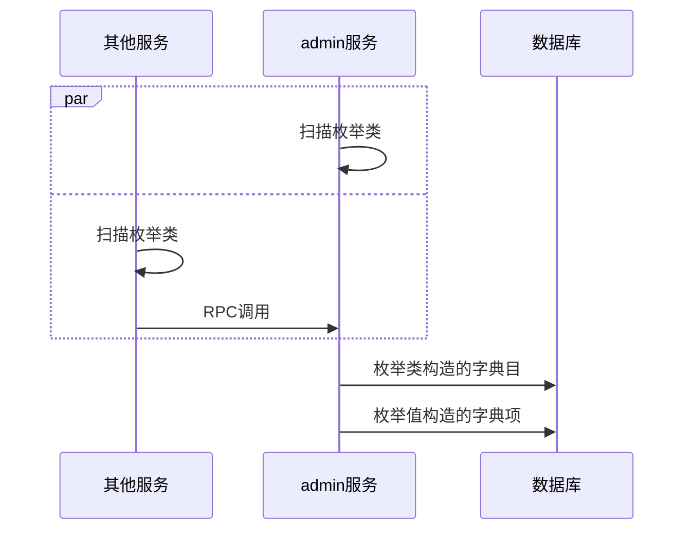

# 字典管理

## 功能描述

### 扫描枚举

```mermaid
sequenceDiagram
  participant others AS 其他服务
  participant admin AS admin服务
  participant db AS 数据库
  
  par 
    admin ->> admin: 扫描枚举类
  and
    others ->> others: 扫描枚举类
    others ->> admin: RPC调用
  end
  admin ->> db: 枚举类构造的字典目
  admin ->> db: 枚举值构造的字典项
```
