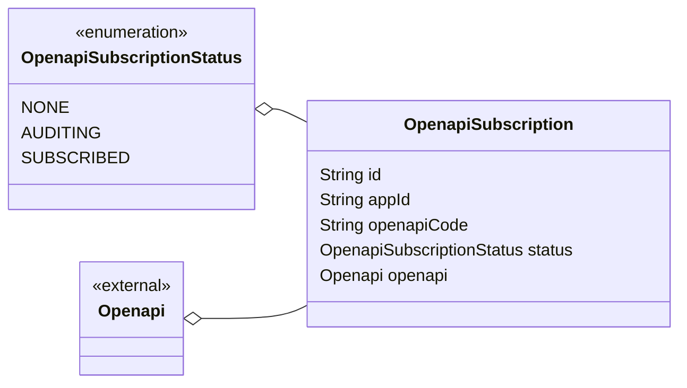

# 接口订阅

## 引用文档

## 术语定义

## 功能描述

## 数据字典

### 对外接口 Openapi

| 字段编码        | 字段名称 | 字段说明 | 字段约束                                                        |
|-------------|------|------|-------------------------------------------------------------|
| id          | 订阅标识 |      | 唯一                                                          |
| appId       | 应用标识 |      |                                                             |
| openapiCode | 接口编码 |      | 应用标识+接口编码 唯一。                                               |
| status      | 订阅状态 |      | 枚举值： NONE: 未订阅; AUDITING: 审核中; SUBSCRIBED: 已订阅; |

## 接口清单

### 查询已发布的接口以及订阅状态

#### HTTP接口

GET /third-party-app/{appId}/subscription

#### 输入输出1

输入：

- `appId`: 应用标识
- `$top`: 数据量
- `$skip`: 数据量*(页码-1)

后端输入：

- 接口状态：已发布

输出：

- 接口列表
  - 订阅状态
  - 接口信息
    - 接口ID

### 订阅接口

#### HTTP接口

POST /subscription

#### 输入输出1

输入：

- 接口ID
- 应用ID

默认值：

- 接口状态。默认为`审核中`。

#### 异常输入输出

- 不能订阅未发布的接口
- 没有权限

### 审核接口

#### HTTP接口

PUT /subscription/audit/{id}

#### 输入输出1

- 接口订阅ID
